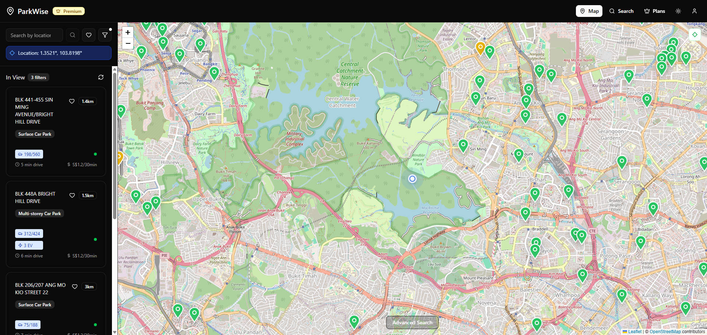
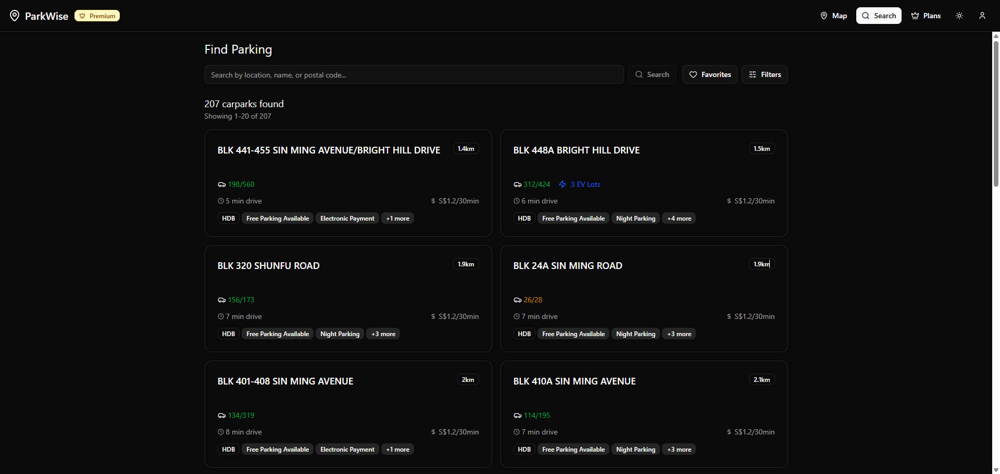
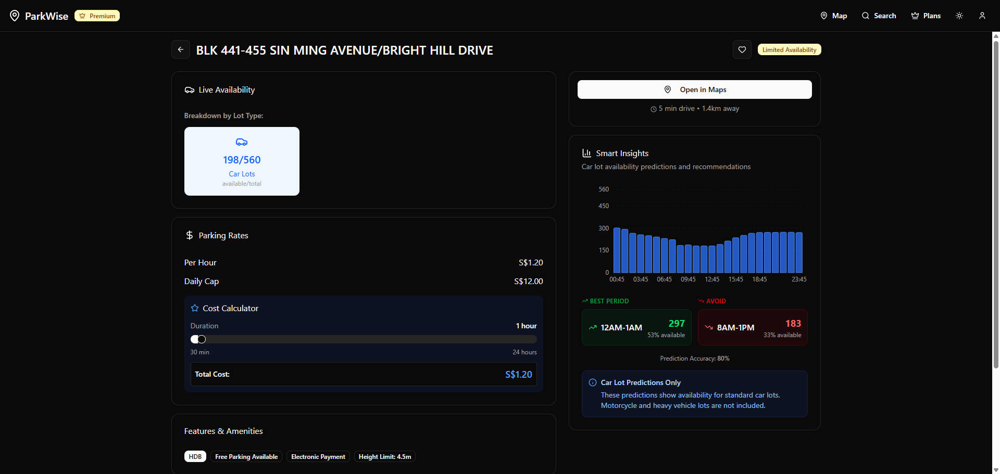
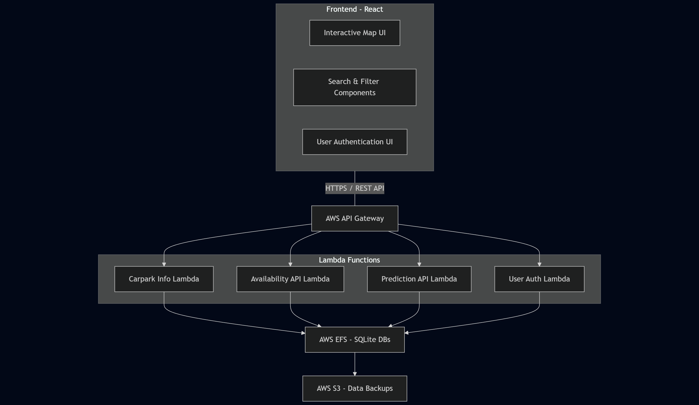

# ParkWise

[](https://nodejs.org/)
[](https://react.dev/)
[](https://www.typescriptlang.org/)

A smart carpark availability and prediction platform for Singapore, helping drivers find available parking spots with real-time data, pricing information, and AI-powered availability predictions.

**[🚀 ParkWise](https://teddye.github.io/ParkWise/)**

---

## Table of Contents

- [Features](#features)
- [Quick Start](#quick-start)
- [Usage](#usage)
- [Tech Stack](#tech-stack)
- [Architecture](#architecture)
- [Code Highlights](#code-highlights)
- [Deployment](#deployment)
- [Environment Variables](#environment-variables)
- [Known Limitations](#known-limitations)
- [Acknowledgments](#acknowledgments)

---

## Features

### 🆓 Free Tier
- **Interactive Map View** - Browse carparks on an interactive map with real-time availability
- **Real-time Availability** - Live carpark occupancy data updated every 5 minutes
- **Basic Search** - Search by location and carpark name
- **Pricing Information** - View current parking rates and daily caps
- **Distance Calculation** - See distances and estimated driving times from your location
- **EV Charging Info** - Identify carparks with electric vehicle charging facilities
- **Detailed Carpark Info** - Operating hours, payment methods, and gantry heights
- **Favorite Carparks** - Save and quickly access your frequently used carparks

### 👑 Premium Features
Everything in Free Plan, plus:
- **24-Hour Availability Forecasts** - AI-powered predictions for the next 24 hours
- **Smart Parking Insights** - Get optimal time recommendations and parking trends
- **Advanced Filtering Options** - Filter by distance, price, carpark type, and availability
- **Ad-Free Experience** - Enjoy the platform without advertisements

### ✨ Additional Features
- **Dark Mode** - Toggle between light and dark themes
- **Responsive Design** - Optimized for desktop
- **Secure Authentication** - User signup and login system
- **Flexible Subscriptions** - Monthly and annual premium plans

---

### Map View

Browse carparks with real-time availability on an interactive map.

### Search & Filter

Find carparks by location with advanced filtering options.

### 24-Hour Predictions (Premium)

AI-powered availability forecasts help you plan ahead.

---

## Quick Start

### Prerequisites

- **Node.js** 18+ and npm
- Modern web browser
- Internet connection (for API access)

### Detailed Setup

1. **Clone the repository**
   ```bash
   git clone https://github.com/TeddYE/ParkWise.git
   ```

2. **Install dependencies**
   ```bash
   npm install
   ```

3. **Configure environment variables**
   
   Copy `.env.example` to `.env`:
   ```bash
   cp .env.example .env
   ```

   Update `.env` with your API endpoints:
   ```env
   VITE_CARPARK_INFO_API=https://your-carpark-info-api.amazonaws.com/endpoint
   VITE_CARPARK_AVAILABILITY_API=https://your-availability-api.amazonaws.com/endpoint
   VITE_AUTH_API=https://your-auth-api.amazonaws.com/dev
   VITE_PREDICTION_API=https://your-prediction-api.amazonaws.com/endpoint
   ```

4. **Start development server**
   ```bash
   npm run dev
   ```

   The application will be available at `http://localhost:5173`

---

## Usage

### Available Scripts

```bash
npm run dev          # Start development server with hot reload
npm run build        # Build production bundle
```

---

## Tech Stack

### Frontend
- **React 19** - UI framework
- **TypeScript** - Type-safe development
- **Vite** - Build tool and dev server
- **Tailwind CSS** - Utility-first styling
- **Leaflet** - Interactive maps
- **Radix UI** - Accessible component primitives
- **Recharts** - Data visualization for predictions
- **Lucide React** - Icon library

### Backend (AWS Lambda)
- **Python 3.11** - Lambda runtime
- **AWS Lambda** - Serverless compute
- **AWS API Gateway** - REST API endpoints
- **AWS EFS** - Persistent storage for SQLite databases
- **AWS S3** - Data dumps and backups
- **SQLite** - Lightweight database

### Machine Learning
- **scikit-learn** - Availability prediction model
- **HistGradientBoostingRegressor** - ML algorithm
- **joblib** - Model serialization

### External APIs
- **Data.gov.sg** - HDB carpark availability and information
- **OneMap API** - Singapore geocoding and routing services

---

## Architecture

ParkWise follows a serverless architecture with clear separation between frontend and backend:



### Data Flow

1. **Data Storage** - Availability and pricing data stored in SQLite on AWS EFS
2. **API Requests** - Frontend makes REST API calls to API Gateway endpoints
3. **Lambda Processing** - API Gateway routes requests to appropriate Lambda functions
4. **Response** - Lambda functions query EFS databases and return JSON responses
5. **Prediction** - ML model generates 24-hour forecasts on-demand

### Project Structure

**Frontend** (`/src/`): React TypeScript app with components organized by feature. Key directories include `components/` for UI, `services/` for API integration, `hooks/` for shared logic, and `types/` for TypeScript definitions.

**Backend** (`/Lambda_APIs/`): Serverless Python functions handling carpark data, availability updates, ML predictions, and user management. Each Lambda is self-contained with its own dependencies.

---

## Code Highlights

Here are some interesting technical implementations in ParkWise:

### 1. ML-Powered Availability Predictions

The prediction engine uses a trained HistGradientBoostingRegressor model with custom feature engineering:

```python
# Lambda_APIs/availability_predictor/lambda_function.py

def build_features(carpark, dt):
    """Feature engineering for ML predictions"""
    return [
        carpark_le.transform([carpark])[0],      # Encoded carpark ID
        meta["total_lots"],                       # Carpark capacity
        lot_type_le.transform([meta["lot_type"]])[0],
        dt.month, dt.weekday(), dt.hour,         # Temporal features
        int(dt.weekday() >= 5),                  # Is weekend?
        is_holiday(dt)                           # Singapore public holiday?
    ]

# Generate 24-hour predictions
times = [start + timedelta(hours=h) for h in range(24)]
preds = model.predict([build_features(carpark, t) for t in times])
```

**Key Features:**
- Combines static carpark metadata with temporal features
- Accounts for Singapore public holidays
- Generates hourly predictions for next 24 hours
- Model pre-loaded at Lambda cold start for fast inference

### 2. Real-time Data Ingestion Pipeline

Automated data pipeline that fetches and processes carpark availability every 5 minutes:

```python
# Lambda_APIs/carpark_availability_rates/update_carpark_availability.py

def lambda_handler(event, context):
    payload = fetch_payload()              # 1. Fetch from data.gov.sg API
    stats = upsert(payload)                # 2. Upsert to SQLite (snapshot + history)
    rebuild_join_snapshot(get_db())        # 3. Rebuild denormalized join table
    
    # 4. Export to S3 for backup
    json_key = upload_json_to_s3(payload, timestamp)
    csv_key = dump_csv_to_s3_from_db(timestamp)
    
    return {"statusCode": 200, "body": json.dumps({**stats, ...})}
```

**Pipeline Features:**
- Fetches from Data.gov.sg API (refreshed every minute)
- Dual storage: current snapshot + append-only history
- Automatic S3 backup in JSON and CSV formats
- Denormalized join table for fast API responses
- Idempotent upsert logic prevents duplicates

### 3. Dynamic Pricing Engine

Time-aware pricing calculation based on Singapore HDB parking rules:

```python
# Lambda_APIs/carpark_availability_rates/carpark_avail_rates_util.py

def refresh_time_dependent_rates(conn):
    """Calculate current parking rates based on time and location"""
    sgt_now = datetime.now(timezone.utc) + timedelta(hours=8)  # Singapore time
    hh, mm = sgt_now.hour, sgt_now.minute
    
    for cp_no, is_central, night_parking in rows:
        # Base rate: $1.20 for central weekday 7am-5pm, else $0.60
        if is_central and sgt_now.weekday() <= 5 and (7 <= hh < 17):
            current_rate = 1.2
        else:
            current_rate = 0.6
        
        # Apply caps: $5 night (10:30pm-7am), $20/$12 day (7am-10:30pm)
        if night_parking and (hh >= 22 and mm >= 30) or (hh < 7):
            cap_type, cap_amt = ("NPS_NIGHT_CAP", 5.0)
        elif 7 <= hh < 22:
            cap_amt = 20.0 if is_central else 12.0
            cap_type = "DAY_CAP"
        
        cur.execute("UPDATE carpark_info SET current_rate_30min=?, ...", ...)
```

**Pricing Logic:**
- **Central area premium**: $1.20/30min during weekday business hours (7am-5pm)
- **Standard rate**: $0.60/30min for all other times/locations
- **Night Parking Scheme**: $5 cap from 10:30pm-7am
- **Day caps**: $20 (central) or $12 (non-central) from 7am-10:30pm
- Automatically updates based on Singapore time zone

### 4. SQLite with WAL Mode for Concurrency

Optimized SQLite configuration for serverless Lambda environment:

```python
# Lambda_APIs/carpark_availability_rates/carpark_avail_rates_util.py

def get_db() -> sqlite3.Connection:
    """Initialize SQLite with optimizations for Lambda + EFS"""
    conn = sqlite3.connect(OPS_DB, timeout=30, isolation_level=None)
    conn.execute("PRAGMA journal_mode=WAL;")        # Concurrent reads during writes
    conn.execute("PRAGMA synchronous=NORMAL;")      # Optimize for network FS
    conn.execute("PRAGMA busy_timeout=5000;")       # Handle concurrent Lambdas
    return conn

def upsert_snapshot(cur, cp_no, lot_type, lots_avail, ...):
    """Upsert with fallback for older SQLite versions"""
    try:
        # Modern UPSERT (SQLite 3.24+)
        cur.execute("""
            INSERT INTO carpark_availability(...) VALUES (?, ?, ?, ...)
            ON CONFLICT(carpark_number, lot_type) DO UPDATE SET
                lots_available = excluded.lots_available,
                update_datetime = excluded.update_datetime, ...
        """, (cp_no, lot_type, lots_avail, ...))
    except sqlite3.OperationalError:
        # Fallback: UPDATE then INSERT if no rows affected
        cur.execute("UPDATE carpark_availability SET ... WHERE ...", ...)
        if cur.rowcount == 0:
            cur.execute("INSERT INTO carpark_availability(...) VALUES (...)", ...)
```

**Database Optimizations:**
- **WAL mode**: Allows concurrent reads during writes
- **Autocommit mode**: Reduces transaction overhead
- **Network-optimized**: Tuned for AWS EFS latency
- **Version compatibility**: Fallback for older SQLite versions
- **Busy timeout**: Handles concurrent Lambda invocations

### 6. Interactive Map with Dynamic Filtering

Real-time carpark filtering and map updates using React hooks:

```typescript
// src/components/MapView.tsx

const filteredCarparks = useMemo(() => {
  let filtered = carparks;

  // Filter by favorites (Premium feature)
  if (showFavoritesOnly && user?.fav_carparks) {
    filtered = filtered.filter(cp => user.fav_carparks.includes(cp.carpark_number));
  }

  // Filter by lot types (C=Car, Y=Motorcycle, H=Heavy Vehicle)
  if (selectedLotTypes.length > 0) {
    filtered = filtered.filter(cp => 
      cp.lots.some(lot => selectedLotTypes.includes(lot.lot_type))
    );
  }

  // Calculate distances and sort by proximity
  const location = searchLocation || userLocation;
  if (location) {
    filtered = filtered
      .map(cp => ({...cp, distance: calculateDistance(location, cp)}))
      .sort((a, b) => (a.distance || 0) - (b.distance || 0));
  }

  return filtered;
}, [carparks, showFavoritesOnly, selectedLotTypes, searchLocation, userLocation]);
```

**Performance Optimizations:**
- `useMemo` prevents unnecessary recalculations
- Efficient filtering pipeline
- Distance calculation only when location available
- Sorted results for better UX

### 7. Geocoding with Postal Code Detection

Smart search that handles both addresses and Singapore postal codes:

```typescript
// src/services/geocodingService.ts

export async function geocodeSearch(query: string) {
  // Check if query is a 6-digit Singapore postal code
  if (isPostalCode(query)) {
    return geocodePostalCode(query);
  }

  // Otherwise, use OneMap search API
  const url = `https://www.onemap.gov.sg/api/common/elastic/search?` +
              `searchVal=${encodeURIComponent(query)}&returnGeom=Y`;
  const data = await fetch(url).then(r => r.json());
  
  if (data.found > 0) {
    return {
      lat: parseFloat(data.results[0].LATITUDE),
      lng: parseFloat(data.results[0].LONGITUDE),
      address: data.results[0].ADDRESS
    };
  }
  throw new Error("Location not found");
}
```

**Features:**
- Automatic postal code detection
- Fallback to address search
- Integration with Singapore's OneMap API
- Type-safe responses with TypeScript

### 8. Real-time Data Caching Strategy

Client-side caching reduces API calls and improves performance:

```typescript
// src/api/cache.ts

const cache = new Map<string, {data: any, timestamp: number}>();
const DEFAULT_TTL = 5 * 60 * 1000; // 5 minutes

export function getCached<T>(key: string, ttl = DEFAULT_TTL): T | null {
  const entry = cache.get(key);
  if (!entry) return null;
  
  const age = Date.now() - entry.timestamp;
  if (age > ttl) {
    cache.delete(key);
    return null;
  }
  return entry.data;
}

export function setCache<T>(key: string, data: T): void {
  cache.set(key, {data, timestamp: Date.now()});
}
```

**Caching Strategy:**
- 5-minute TTL for availability data (matches backend update frequency)
- In-memory cache for session duration
- Automatic cache invalidation on expiry
- Reduces load on Lambda functions

### 9. Secure Password Hashing with Salt + Pepper

User authentication implements defense-in-depth password security:

```python
# Lambda_APIs/users_db/user_profiles.py

PEPPER = os.getenv("PEPPER", "")  # Secret not stored in database

def hash_password(password: str, salt_bytes: bytes) -> bytes:
    """Hash password using scrypt with per-user salt + global pepper"""
    return hashlib.scrypt(
        (password + PEPPER).encode("utf-8"),
        salt=salt_bytes,
        n=2**14, r=8, p=1, dklen=64  # 16,384 iterations, memory-hard
    )

def make_hash_and_salt(password: str) -> tuple[str, str]:
    salt = os.urandom(16)  # Random 16-byte salt per user
    pw_hash = hash_password(password, salt)
    return base64.b64encode(pw_hash).decode(), base64.b64encode(salt).decode()

def verify_password(password: str, salt_b64: str, hash_b64: str) -> bool:
    actual = hash_password(password, base64.b64decode(salt_b64))
    expected = base64.b64decode(hash_b64)
    return hmac.compare_digest(actual, expected)  # Timing-attack resistant
```

**Security Features:**
- **Scrypt algorithm**: Memory-hard function, resistant to GPU/ASIC attacks
- **Per-user salt**: 16-byte random salt prevents rainbow table attacks
- **Global pepper**: Environment variable secret adds extra layer (not in database)
- **Constant-time comparison**: `hmac.compare_digest()` prevents timing attacks
- **High cost factor**: 2^14 iterations makes brute-force computationally expensive
- **Defense in depth**: Even if database is compromised, passwords remain secure without PEPPER

---

## Deployment

### Frontend Deployment

Deploy the React app to GitHub Pages or any static hosting service:

```bash
npm run deploy  # Deploy to GitHub Pages
```

### Backend Deployment

The backend consists of AWS Lambda functions that must be deployed manually.

Quick overview:
- Package Lambda functions with dependencies
- Deploy to AWS Lambda via Console or CLI
- Configure API Gateway endpoints
- Set up EFS for SQLite databases
- Update frontend `.env` with API URLs

---

## Environment Variables

### Frontend Configuration

Create a `.env` file in the project root:

```env
# Required API Endpoints
VITE_CARPARK_INFO_API=https://your-api.amazonaws.com/carpark-info
VITE_CARPARK_AVAILABILITY_API=https://your-api.amazonaws.com/availability
VITE_AUTH_API=https://your-api.amazonaws.com/auth
VITE_PREDICTION_API=https://your-api.amazonaws.com/predictions

# Optional Configuration
VITE_API_TIMEOUT=10000
VITE_CACHE_TTL=300000
```

### Backend Configuration

Set in Lambda configuration:

```env
# Database paths
OPS_DB=/mnt/efs/ops/ops.sqlite
USERS_DB=/mnt/users/user_profiles.sqlite

# S3 configuration
S3_BUCKET=your-bucket-name

# Security
PEPPER=your-secret-pepper-for-password-hashing

# API configuration
INFO_RESOURCE_ID=d_23f946fa557947f93a8043bbef41dd09
PAGE_SIZE=5000
```

---

## Known Limitations

1. **No Local Backend** - Lambda functions require AWS infrastructure (EFS, S3, API Gateway) to function
2. **Manual Deployment** - No CI/CD pipeline included; Lambda functions must be manually packaged and uploaded
3. **Data Source Dependency** - Relies on Data.gov.sg API availability and data quality
4. **Static ML Model** - Pre-trained model requires manual retraining and redeployment
5. **Geographic Scope** - Limited to Singapore HDB carparks only
6. **Basic Authentication** - No OAuth or social login integration
7. **Simulated Payments** - No real payment gateway integration
8. **Web Only** - No native mobile applications

---

## Acknowledgments

- **Data.gov.sg** - For providing open carpark data
- **OneMap API** - For geocoding and routing services
- **AWS** - For serverless infrastructure
- **React Community** - For excellent libraries and tools

### AI Usage Declaration

This project was developed with assistance from AI tools (ChatGPT, Claude) for code generation, documentation, debugging. All code has been reviewed, tested, and validated by human developers. Core architecture and design decisions were made by the development team.

**⚠️ Note**: This is an educational project. The prediction model and data are provided as-is without guarantees of accuracy. Always verify parking availability on-site.
